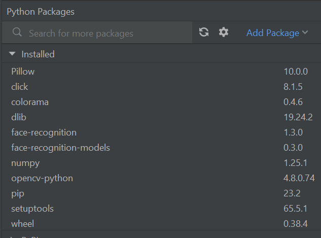

# face recognition 
- Added example from [youtube video](https://www.youtube.com/watch?v=tl2eEBFEHqM)  
  code is in this [github repo](https://github.com/federicoazzu/webcam_face_recognition)
- put pictures of known faces in `faces` directory.

## used packages
as shown in pycharm:


I think it is enough to install

    pip install numpy opencv-python face-recognition

the other packages are installed as a dependency from these


## run in pycharm
Have file `run.py` or `recognition.py` open in editor 

## crash fixed 2023-07-18

### update
[Added this fix](https://stackoverflow.com/questions/75926662/face-recognition-problem-with-face-encodings-function) 
and now the code seems to work!

### before update
The code runs for a while but then crashes with the following message:

```py
C:\Users\LG\misc\gh\FaceDatabas\venv\Scripts\python.exe C:\Users\LG\misc\gh\FaceDatabas\recognition.py 
['lgw.png']
Traceback (most recent call last):
  File "C:\Users\LG\misc\gh\FaceDatabas\recognition.py", line 107, in <module>
    fr.run_recognition()
  File "C:\Users\LG\misc\gh\FaceDatabas\recognition.py", line 59, in run_recognition
    self.face_encodings = face_recognition.face_encodings(rgb_small_frame, self.face_locations)
                          ^^^^^^^^^^^^^^^^^^^^^^^^^^^^^^^^^^^^^^^^^^^^^^^^^^^^^^^^^^^^^^^^^^^^^
  File "C:\Users\LG\misc\gh\FaceDatabas\venv\Lib\site-packages\face_recognition\api.py", line 214, in face_encodings
    return [np.array(face_encoder.compute_face_descriptor(face_image, raw_landmark_set, num_jitters)) for raw_landmark_set in raw_landmarks]
           ^^^^^^^^^^^^^^^^^^^^^^^^^^^^^^^^^^^^^^^^^^^^^^^^^^^^^^^^^^^^^^^^^^^^^^^^^^^^^^^^^^^^^^^^^^^^^^^^^^^^^^^^^^^^^^^^^^^^^^^^^^^^^^^^^
  File "C:\Users\LG\misc\gh\FaceDatabas\venv\Lib\site-packages\face_recognition\api.py", line 214, in <listcomp>
    return [np.array(face_encoder.compute_face_descriptor(face_image, raw_landmark_set, num_jitters)) for raw_landmark_set in raw_landmarks]
                     ^^^^^^^^^^^^^^^^^^^^^^^^^^^^^^^^^^^^^^^^^^^^^^^^^^^^^^^^^^^^^^^^^^^^^^^^^^^^^^^
TypeError: compute_face_descriptor(): incompatible function arguments. The following argument types are supported:
    1. (self: _dlib_pybind11.face_recognition_model_v1, img: numpy.ndarray[(rows,cols,3),numpy.uint8], face: _dlib_pybind11.full_object_detection, num_jitters: int = 0, padding: float = 0.25) -> _dlib_pybind11.vector
    2. (self: _dlib_pybind11.face_recognition_model_v1, img: numpy.ndarray[(rows,cols,3),numpy.uint8], num_jitters: int = 0) -> _dlib_pybind11.vector
    3. (self: _dlib_pybind11.face_recognition_model_v1, img: numpy.ndarray[(rows,cols,3),numpy.uint8], faces: _dlib_pybind11.full_object_detections, num_jitters: int = 0, padding: float = 0.25) -> _dlib_pybind11.vectors
    4. (self: _dlib_pybind11.face_recognition_model_v1, batch_img: List[numpy.ndarray[(rows,cols,3),numpy.uint8]], batch_faces: List[_dlib_pybind11.full_object_detections], num_jitters: int = 0, padding: float = 0.25) -> _dlib_pybind11.vectorss
    5. (self: _dlib_pybind11.face_recognition_model_v1, batch_img: List[numpy.ndarray[(rows,cols,3),numpy.uint8]], num_jitters: int = 0) -> _dlib_pybind11.vectors

Invoked with: <_dlib_pybind11.face_recognition_model_v1 object at 0x000002645C471230>, array([[[110, 112, 103],
        [109, 116, 101],
        [110, 113, 104],
        ...,
        [211, 200, 195],
        [211, 202, 191],
        [211, 201, 196]],

       [[114, 112,  96],
        [111, 114,  98],
        [114, 114, 104],
        ...,
        [209, 199, 193],
        [209, 200, 189],
        [211, 198, 193]],

       [[115, 111, 103],
        [111, 112, 101],
        [111, 112,  97],
        ...,
        [207, 198, 191],
        [207, 195, 191],
        [208, 198, 191]],

       ...,

       [[162, 172, 169],
        [162, 177, 174],
        [159, 179, 181],
        ...,
        [125, 133, 126],
        [127, 136, 130],
        [126, 135, 135]],

       [[162, 174, 176],
        [162, 178, 176],
        [161, 178, 173],
        ...,
        [125, 131, 127],
        [130, 132, 134],
        [126, 135, 137]],

       [[163, 174, 177],
        [160, 177, 173],
        [161, 176, 171],
        ...,
        [126, 134, 132],
        [130, 131, 132],
        [127, 134, 139]]], dtype=uint8), <_dlib_pybind11.full_object_detection object at 0x000002645C9390F0>, 1

Process finished with exit code 1
```
